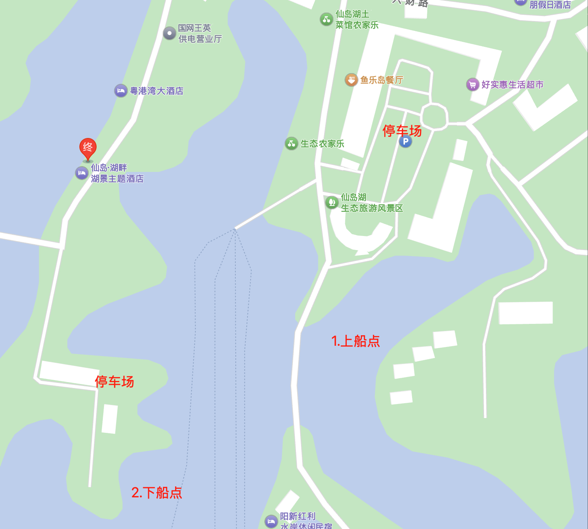

# 黄石

2 日游

## 行程安排

### 8.16 湖北董家口溯溪

1. `09:00-10:30` 地图导航 湖北董家口风景区
2. `10:30-16:00` 溯溪活动
3. `16:00-16:35` 仙岛湖，映月民宿(仙岛湖旅游码头店)

### 8.17 仙岛湖

仙岛湖又叫千岛湖，由 1002个岛屿组成，成因是因为修建[王英水坝](https://baike.baidu.com/item/%E7%8E%8B%E8%8B%B1%E6%B0%B4%E5%BA%93/2564950) 导致之前山地被淹形成的人工湖。仙岛湖水面约4.6万亩，库容6.7亿立方米，享有“荆楚第一奇湖”之美誉。 因湖畔山崖上悬有一块“灵通仙岛”的古匾而得名仙岛湖。 仙岛湖与杭州千岛湖、加拿大千岛湖并称“世界三大千岛湖”。

1. `09:00:09:30` 附近过早
2. `9:40-10:00` 仙岛湖游客中心等待轮渡
3. `10:00-10:25` 渡轮前往第一个景点望仙崖
4. `10:25-12:30` 望先崖经典游览
   1. `电动滑梯` 上行 30 (距离还好体力充沛建议不行，老人小孩建议上下都乘坐)
   2. `滑梯` 下行 30， 建议小孩乘坐
   3. `水上皮艇` 下行 50， 速度差不多骑电动车速度 30KM/h， 酌情选择
5. `12:40-12:50` 到观音洞
6. `12:50-13:30` 观音洞游览，有一个溶洞可以看
   1. `滑索` 80 分两级
7. `13:30-14:00` 渡船返回仙岛湖游客游客中心
8. `15:00-17:00` 返回武汉

## 成本

1. 溯溪自带干粮即可，成本人均 100
2. 仙岛湖
   1. 住宿 120 民宿还算干净，窗外风景可以
   2. 吃饭人均 50，还不错
   3. 门票分东西线，我们玩的东线，基本 5 个小时可以逛完
      1. 东线包含景点望仙崖、观音洞，道路比较陡峭适合年轻人
      2. 西线包含经典仙龙岛、仙湖画廊，山路平坦，适合拖家带口游完，视频可参考 [B 栈](https://www.bilibili.com/video/BV1oP411m7o8/?vd_source=ffdd116a30e16e879ae367f41953bcd0)

## 评价

整体体验不错，价格适中，人均价位住宿+门票+吃饭 差不多 300 左右。适合周末带娃党

## 注意事项

1. 董家湖风景区就是溪水边，水较浅差不多半米适合娃玩，下午人数较多建议早点去
2. 此外夏天出行注意防晒多带衣物，避免玩水打湿
3. 注意上船点和下船点位置不一样，早上建议送到下船点后，停车到上船点附近停车场
   
4. 参看图片，周边有很多吃饭的地方，需要购买东西可以去好实惠生活超市
