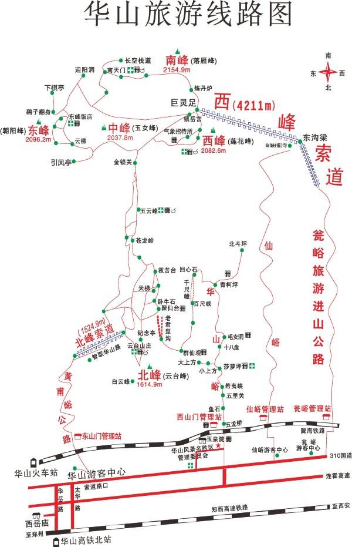

# 西安

## 行程

### 第一天

1. `7:10-8:00` 过早,休息
2. `8:00-9:00` 西安火车站 306 华清池站下(票价 6 元),也可以直接做大巴去,票价 8 元 0
3. `9:00-12:00` 华清宫
4. `12:00-12:30` 午餐
5. `12:30-12:45` 在下车地方做 306 到兵马俑博物馆(票价 3 元)
6. `12:45-14:40` 铜车展厅,1,2,3 号坑
    * 一号坑兵马俑多一些
    * 二号坑有一点
    * 三号基本就就是一个坑
7. `14:50-16:00` 回到西安火车站
8. `16:00-16:40` 到鼓楼
9. `17:00-19:00` 回民街

### 第二天

1. `9:00` 起床
2. `9:00-12:30` 查找去华山行程
3. `12:30-13:00` 中餐,肉夹馍 + 凉皮
4. `13:00-15:30` 休息
5. `15:30-16:30` 大唐芙蓉园 + 大雁塔
6. `16:30-17:30` 明城墙 + 骑自行车在市区逛(西安基本主干道都有自行车道)
7. `18:00-21:00` 永兴坊

### 第三天

1. `7:30-8:30` 打的西安北站 (108 元)
    > 坐车 256 到国展中心 2元 (40 分钟),会展中心 D 口到西安北站 (40 分钟)
    > **一定记得去华山提前买来回车票!!**
2. `9:11-9:41` 华山北站
4. `10:00-10:20` 华山游客中心
5. `10:20-11:55` 从游客中心排队上西峰索道 (排队时长 95 分钟)
    > 建议从东峰坐索道,西峰下人流密度会小一点
6. `11:55-12:50` 做接驳车到华山西峰索道山脚
7. `12:50-13:45` 排队坐西峰缆车
8. `13:45-14:00` 西峰缆车下
9. `14:00-14:35` 西峰
10. `14:35-15:10` 南峰
    > 最高峰,有华山论剑石像,拍照需收费
11. `15:10-15:40` 东峰
    > 南天门这里有长空栈道,朝阳台有鹞子翻身
12. `15:40-16:00` 中锋
13. `16:00-16:40` 北峰
    > 这里可以坐索道下山,也可选择徒步下山
14. `16:40-18:00` 到达玉泉院
    > 走这条路下上的人很少,风景不错,很多晚上上山的
15. `18:00-18:11` 打的到华山北站 (20 元)
16. `19:44-20:11` 西安北
17. `20:11-21:00` 钟楼地铁站 c 出口
18. `21:00-21:20` 红红酸菜炒米
19. `21:20-21:30` 老马家腊牛肉夹馍
20. `21:30-21:35` 贾三灌汤包 (牛肉 16元 + 羊肉 17 元 + 2元 打包费)
21. `21:30-21:45` 马三汤包 (三鲜包 18元 + 1元 打包费)
22. `21:45-21:50` 盛志望麻酱凉皮 (7 元)
23. `21:50-22:30` 钟楼 c 口 到 会展中心 D 口
24. `22:30-23:02` 国展中心打的到商都摩卡公寓 (打的 20 元)

#### 建议

> 1. 网上提前订票 267 (直接去可能买不到票) ,全价 300,淡季 12月-1月 只要 240,网上 217
> 2. 微信上搜索华清宫,兵马俑的公众号和小程序便于游玩
> 3. 坐车 306 注意真伪!票价全程 7 元,到华清宫 6 元
> **有直达的大巴,价格会贵 2 元**

#### 感触

1. 自由行可以按照自己的喜好逛遍景区,可以提前做好先关准备,
有条件请一个导游讲解.
2. 相逢即是缘,在火车站充电,遇到一个阿姨,五十多岁,讲了自己的人生经历
    * 1983 16岁,西安火车站卖冰棍,5.3 分,进价 3.5 分,净赚 1.8 分
    * 陆续做过服装批发,买菜等等
    * 现在生意
        * 西安火车站出站口,租了个门面进行行李寄存,价格 10 元/天
        ,请了 4 人,门面 20 万/年,有个人和乘客闹矛盾,大家动手被开除,
        加上自己四个人,四班倒
        * 西安火车站门口开超市
        * 南宁租了 6 个水果摊,其中转租 5 个,留一个自己卖水果
        * 2015 年海南买了一套房,面积 70 多平,价格当时 1.5万/平,现在翻了 3 倍
        * 两个孩子
            * 29 岁在加油站
            * 25 岁
    
### 第三天

1. `9:11-9:45` 西安北-华山北 动车 40 分钟
2. `9:45-10:00` 下车广场,做华山游客中心免费车(1路,2路)到游客中心
3. `10:00-17:00` 西峰上北峰下，上西峰顶，然后是南峰---长空栈道----南天门----南峰路口----东峰----云梯----中峰----金锁关----北峰
4. 乘坐环保车回到游客中心
5. 做大巴回高铁站
6. 返回西安北站

## 吃

### 回民街

#### 老米家羊肉泡馍

泡馍 35 元/腕
烤羊蹄

#### [甑糕](https://baike.baidu.com/item/%E7%94%91%E7%B3%95)

枣 + 糯米,三层米四层枣用甑蒸煮,
甗类似蒸架,镂空下面为鬲放水蒸煮.

#### 红红酸菜炒米

普通的酸菜肉丝炒饭 (15 元) 还行

#### 贾三灌汤包子

牛肉 16 元,还行,有点贵
羊肉 17 元,膻味太重
打包盒一个 2 元

####  盛家酿皮

类似热干面只不过是凉皮拌面,不好吃

* [ ] 镜糕
* [ ] 老李家的biangbiang面
* [ ] 定家小酥肉
* [ ] 刘纪孝腊牛羊肉(牛肉夹馍)

### 永兴坊

#### 酸梅汁

还行 10 元

#### 炒凉粉

还行 10 元

#### 驴肉

25 差不多

#### 手打猪肉丸

10 元,差不多

#### 水煮羊肚

15 元

#### 毛笔酥

有特色,还行 10 元

#### 米酒

10 元,还行

#### 桑椹汁

10 元

## 景点

### 兵马俑

分冷季和淡季

* `12 月 - 2 月` 150
* `12 月 - 2 月` 120
  
1. 博物馆
展出了庞贝石器,楚国铜器,秦代铜车等展品
1. 1,2,3 号坑,1 号坑比较完整

路线,西安火车站 306 直达,票价 7 元

### 华清宫 (骊山+华清池)

主要是爬山,烽火台上看一下还行!

### 华山

查看华山地图,到华山有三条路

* 北峰索道上山
* 玉泉院上山
* 西峰索道上山

整个华山门票分为如下几部分
* 从华山游客中心到北峰索道口,接驳车 20 元 (自驾可省略)
* 北峰索道 100 元 
* 华山门票 160 元
* 从华山游客中心到西峰索道口,接驳车 40 元 (自驾可省略)
* 西峰索道 100 元

> 上面是旺季,淡季可能会便宜一些

所以在网上购票的时候会看到如下类型

1. 华山大门票 160 元
2. 西上北下,北山西下套票 (飞猪 435 元)
3. 西上西下套票 (飞猪 514 元)
4. 北上北下 (飞猪 345 元)

说白了就是上面 5 个门票的排列组合.
重点区别如下

因为西峰和北峰只能坐索道上华山,如果你只购买了大门票只能够从玉泉院上山和下山,
这条路是最累的,如果要看逛完 5 个峰后你必须原路返回

经典路线为西上北下,原因如下
1. 西上很方便到最高峰南峰
2. 北下离华山北站更近
3. 旅途比较轻松,因为地势高一些,下山路会多一点
    > 但是此条路线在旺季排队会很严重,错过了玉泉院下山的风景

体力好一点,就不要从买北峰索道,直接从玉泉院下山,这样还可一看一下下山风景,下山大概要 2 小时.

如果想爬山,买西下的套票包括,西峰索道+接驳车+大门票,先从玉泉院上,
这条路线适合看日出,晚上 22:00 登山,早上 4:00 到北峰,
5:00 到南峰看日出,看完直接做西峰索道下山回去

如果精力旺盛,就玉泉院上,玉泉院下

其他的情况请自行排列组合.

### 明城墙

门票 54 元,值得去

### 钟楼鼓楼

坐地铁 2 号线到钟楼 c 出口下,鼓楼在回民街,地标性建筑

### 大小雁塔

很大的广场,值得去

> 建议在西安游玩多起自行车,城市自行车道很齐全
